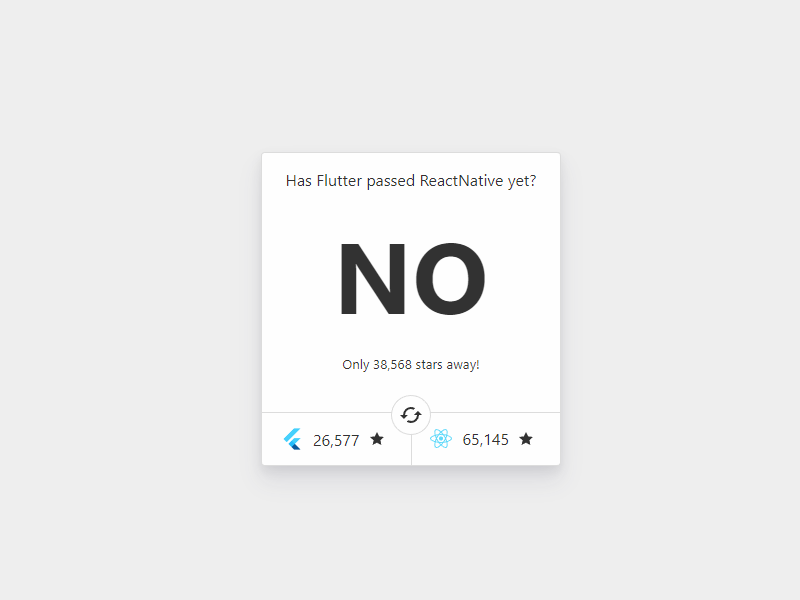

# Has Flutter passed React Native yet?

> Just a fun little site to compare GitHub stars of Flutter and React Native

> This is a fork of the project *Has Vue passed React yet?* by @stursby (https://github.com/stursby/hasvuepassedreactyet). K2 to him. I've just run search and replace and a couple of commands.

> This project is not affiliated to Flutter and is responsability of his author



### Getting Started

To run this locally, clone the repo and use Yarn or NPM to install the dependencies. (You’ll also need Node.js installed)

```bash
git clone https://github.com/sergiandreplace/hasflutterpassedreactnativeyet.git
cd hasflutterpassedreactnativeyet
yarn
```

### Development

Start a dev server on [http://localhost:8080](http://localhost:8080)

```bash
yarn dev
```

### Production

To build for prod, run the following:

```bash
yarn build
```
